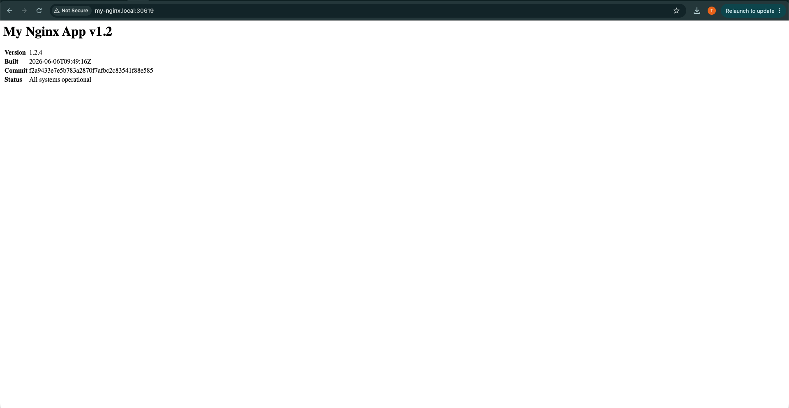
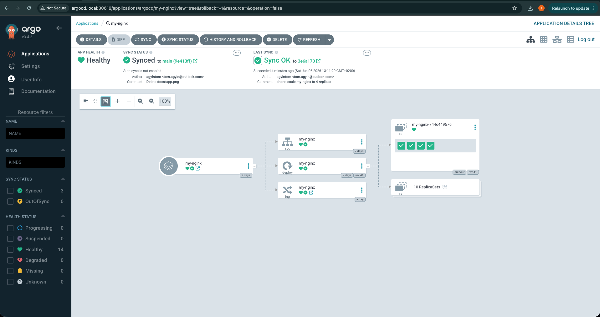
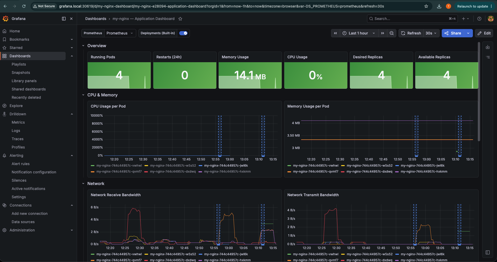
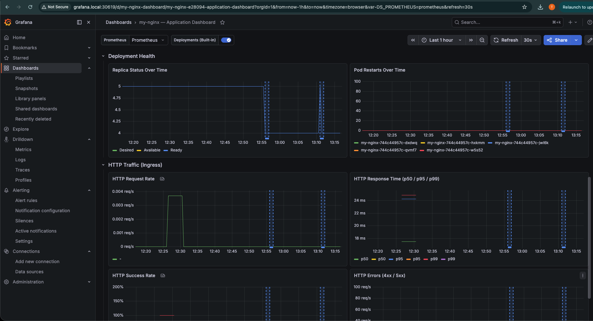

# My Nginx App — Kubernetes CI/CD Project

> Forked from the interview task repository. This is a peronal solution
> demonstrating a full GitOps-based Kubernetes deployment pipeline with
> semantic versioning, and automated releases.

---

## Screenshots

### Live Application
> The app serves a page showing the current version, build timestamp, and git commit SHA 
> updated automatically on every pipeline release.



### ArgoCD — Applications Overview
> ArgoCD applications managing deployments: `my-nginx` (this project).
> Showing **Healthy** and **Synced** status, meaning the cluster matches Git exactly.



### Grafana — Pod Metrics
> Kubernetes compute resource dashboard for the `my-nginx` pod showing
> memory usage, running pods, desired replicas, deployment health, receive/transmit bandwidth — all healthy.




---

## Infrastructure

This project runs entirely on a **local bare metal Kubernetes cluster** built on
**Oracle VirtualBox** virtual machines running on a Mac host (Apple Silicon — ARM 64-bit).

| VM | Role | OS | CPU | RAM | Disk |
|---|---|---|---|---|---|
| K8s-Master | Control plane + runner | Ubuntu 24.04 ARM 64-bit | 2 vCPU | 8 GB | 80 GB |
| K8s-Node02 | Worker node | Ubuntu 24.04 ARM 64-bit | 2 vCPU | 8 GB | 25 GB |

**Network:** Bridged adapter (Intel PRO/1000 MT Desktop via Wi-Fi) — both VMs are on the same local network as the host and accessible by IP.

No cloud providers were used  everything runs locally on VirtualBox.

---

## Live Demo

Access the running app at:
```
http://my-nginx.local:30619/
```
The page displays the current version, build date, and git commit SHA 
updated automatically on every release.

---

## What Was Built

### Infrastructure
- **Kubernetes cluster** — bare metal kubeadm on VirtualBox VMs (1 master + 1 worker)
- **Private Docker Registry UI** — visual interface for browsing images at `192.168.178.115:8085`
- **Nginx Ingress Controller** — routes external traffic into the cluster
- **ArgoCD** — GitOps continuous delivery, watches this repo and syncs the cluster
- **Prometheus + Grafana** — cluster and pod monitoring with custom dashboard

### Application
- Custom Dockerfile based on `nginx:alpine`
- Serves an HTML page showing version, build date, and commit SHA
- Build args (`VERSION`, `BUILD_DATE`, `GIT_SHA`) injected at build time by the pipeline

### CI/CD Pipeline (GitHub Actions — self-hosted runner)
Six sequential jobs on every push to `main`:

| Job | What it does |
|---|---|
| **Release** | Reads commits, bumps semver, creates Git tag, generates CHANGELOG.md |
| **Build** | Builds Docker image tagged with semver + SHA |
| **Push** | Pushes both tags to private registry |
| **Pre-pull** | SSHs into all nodes and pulls image into `k8s.io` containerd namespace |
| **Deploy** | Updates `k8s/nginx.yaml` with new tag, commits to Git, ArgoCD syncs |
| **Cleanup** | Removes local build images from runner |

### GitOps
- ArgoCD watches the `k8s/` directory in this repo
- Every pipeline deploy commits the new image tag to `k8s/nginx.yaml`
- ArgoCD detects the Git change and applies it automatically
- `prune: true` and `selfHeal: true` ensure Git is always the source of truth
- Rollbacks are done via Git revert — no manual kubectl commands

### Semantic Versioning + Changelog
- Uses `python-semantic-release` driven by Conventional Commits
- Commit prefixes determine the version bump:
  - `fix:` → patch (1.0.0 → 1.0.1)
  - `feat:` → minor (1.0.0 → 1.1.0)
  - `feat!:` → major (1.0.0 → 2.0.0)
- `CHANGELOG.md` is auto-generated and pushed to GitHub on every release

---

## Repository Structure

```
.
├── .github/
│   └── workflows/
│       └── ci-cd.yml          # GitHub Actions pipeline (6 jobs)
├── argocd/
│   └── application.yaml       # ArgoCD Application manifest
├── docs/                      # Screenshots used in this README
├── k8s/
│   ├── nginx.yaml             # Deployment + Service (managed by pipeline)
│   └── ingress.yaml           # Ingress resource
├── shell/
│   └── script.sh              # Shared logging utility sourced by pipeline
├── Dockerfile                 # nginx:alpine with build arg injection
├── pyproject.toml             # semantic-release configuration
├── CHANGELOG.md               # Auto-generated, do not edit manually
└── .gitignore
```

---

## Challenges & Solutions

### containerd v2.2.1 HTTP registry bug
The node's CRI layer ignored the `certs.d` configuration for plain HTTP
registries and kept trying HTTPS. After exhaustive debugging (config dumps,
strace, multiple config approaches), the solution was to pre-pull images
directly into the `k8s.io` containerd namespace using `ctr` before the
pod is scheduled — bypassing the broken CRI pull path entirely.

### ArgoCD overwriting pipeline deploys
ArgoCD kept reverting to the image tag in Git, which was stale. The fix
was to have the pipeline commit the updated `nginx.yaml` back to Git
(with `[skip ci]`) before triggering the rollout, so ArgoCD and the
pipeline always agree on what should be deployed.

### git push conflicts in the deploy job
The `release` job pushes the changelog and tag after the `deploy` job
has already checked out the repo, causing push rejections. Fixed by
using `ref: main` in the deploy job checkout so it always gets the
absolute latest state of the branch, not the SHA that triggered the run.

---

## Key Design Decisions

**VirtualBox**
VirtualBox provides a realistic multi-node bare metal environment. Running
kubeadm across two separate VMs exposed real infrastructure challenges 
node networking, containerd configuration, registry access that single-node
or managed solutions abstract away entirely.

**Bare metal kubeadm**
kubeadm mirrors production Kubernetes more closely. k3s bundles components
and makes opinionated decisions that don't reflect how clusters are run
in enterprise environments.

**Docker registry UI**
The Docker Registry UI provides a visual interface for browsing images, 
tags, and content digests stored in the private registry 
making it easy to verify that the pipeline pushed the correct image and tag after every release. 
Without it, inspecting the registry requires raw API calls via curl. 
Having a UI makes the demo more accessible during the interview and gives immediate visual confirmation
that the full pipeline  build, tag, push completed successfully.

**Why ClusterIP + Ingress over NodePort?**
NodePort exposes high random ports and bypasses the ingress layer.
ClusterIP + Ingress is the production-standard approach single entry
point on port 80, supports path routing and future TLS termination.

**Why python-semantic-release over Node.js tools?**
The runner had Python 3.12 available but no Node.js. python-semantic-release
provides the same Conventional Commits-driven versioning with no additional
runtime dependencies to install.

**Why commit image tag back to Git instead of kubectl apply?**
ArgoCD uses Git as the source of truth. A direct `kubectl apply` would be
overwritten on the next ArgoCD sync. Committing the tag to Git means
ArgoCD, Git, and the cluster are always in sync — this is the GitOps contract.

---

## How to Trigger a Release

```bash
# Patch bump (bug fix)
git commit -m "fix: your fix description"

# Minor bump (new feature)
git commit -m "feat: your feature description"

# Major bump (breaking change)
git commit -m "feat!: your breaking change description"

git push origin main
```

The pipeline handles everything from there.

---

## Rollback

```bash
# Find the commit that deployed the version you want
git log --oneline | grep "deploy"

# Restore nginx.yaml from that commit
git show <commit-sha>:k8s/nginx.yaml > k8s/nginx.yaml

# Commit and push — ArgoCD will sync automatically
git add k8s/nginx.yaml
git commit -m "fix: rollback to vX.Y.Z"
git push origin main
```

